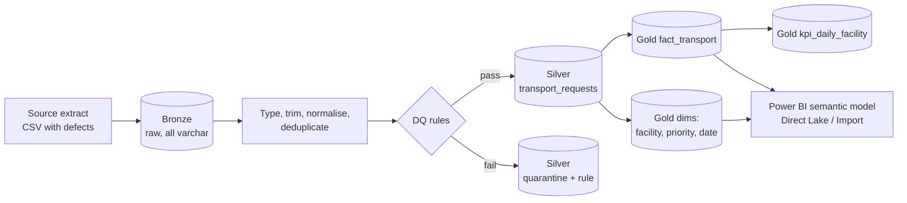

# Medallion Lakehouse Demo — Hospital Patient Transport KPIs

> **Representative portfolio project.** Written independently on synthetic data. It is not client code and contains no patient, employee, or facility data. Facility names are invented.

A Bronze → Silver → Gold pipeline that turns messy patient-transport request logs into a tested star schema and a daily KPI table ready for a Power BI semantic model. The layers follow the Microsoft Fabric Lakehouse medallion pattern; storage is local Parquet processed with DuckDB so it runs on any laptop and in CI.

## Business problem

Hospital support-services teams are measured on how quickly patients are moved after a request, by priority (STAT / Urgent / Routine) and by facility. Source logs arrive with duplicates, inconsistent codes, and missing timestamps, so dashboards disagree with operations. This pipeline fixes that upstream: every raw row is either accepted into a conformed table or quarantined with the rule that rejected it, and counts reconcile from Bronze to Gold.

## Architecture



| Layer | Contents | Rules applied |
|---|---|---|
| Bronze | `transport_requests.csv` exactly as landed | none (immutable) |
| Silver | `transport_requests.parquet`, `quarantine.parquet` | trim/upper-case codes, map priority variants, parse timestamps with `try_strptime`, drop resent duplicates (`QUALIFY row_number()`), four data-quality rules |
| Gold | `fact_transport`, `dim_facility`, `dim_priority`, `dim_date`, `kpi_daily_facility` | surrogate keys, response and total minutes, on-time flag vs priority target, P90 response |

## Sample output (`--rows 20000`, default seed)

Reconciliation: 20,200 raw rows → 20,000 distinct → 19,722 accepted + 278 quarantined.

| Quarantine rule | Rows |
|---|---:|
| missing_dispatch_time | 200 |
| unknown_priority | 78 |

| Facility | Requests | Avg response (min) | On-time rate |
|---|---:|---:|---:|
| Riverside General | 6,816 | 42.4 | 49.0% |
| Lakeview Medical Center | 5,968 | 41.9 | 49.8% |
| Harbor Community Hospital | 3,974 | 42.6 | 49.5% |
| Summit Regional | 2,964 | 41.6 | 47.0% |

(The data is random, so the numbers only show that the pipeline works, not real performance.)

## Quick start

```bash
git clone https://github.com/samarthass00/fabric-medallion-lakehouse-demo.git
cd fabric-medallion-lakehouse-demo
python -m venv .venv && source .venv/bin/activate
pip install -r requirements.txt
python -m medallion.pipeline --rows 20000 --lakehouse lakehouse
pytest -q
```

## Tests

`tests/test_pipeline.py` checks that:

- row counts reconcile across layers (accepted + quarantined = distinct raw),
- Silver has unique keys and only conformed codes,
- every quarantined row names a known rule,
- every Gold foreign key resolves to a dimension row,
- the KPI table totals match the fact table.

## Mapping to Microsoft Fabric

| Here | In Fabric |
|---|---|
| `lakehouse/bronze/*.csv` | Lakehouse **Files** area, landed by a Data Factory pipeline or shortcut |
| DuckDB SQL in `build_silver` / `build_gold` | Notebook (Spark SQL / PySpark) or Dataflow Gen2 writing **Delta** tables |
| Parquet in `silver/`, `gold/` | Delta tables in the Lakehouse **Tables** area (OneLake) |
| `kpi_daily_facility`, star schema | Power BI semantic model in **Direct Lake** mode, promoted with deployment pipelines |

The SQL is written to translate to Spark SQL with small changes (`try_strptime` → `try_to_timestamp`, `date_diff` → `timestampdiff`).

## Security

No credentials, connection strings, or tenant settings are used. The generated `lakehouse/` folder is git-ignored.

## Limitations and next steps

- Batch full refresh only; next step is incremental loads by watermark and Delta `MERGE`.
- DQ rules are inline SQL; a rules table or Great Expectations suite would make them configurable.
- Planned: a PySpark notebook version and a Direct Lake semantic model on the Gold tables.

## License

MIT — see [LICENSE](LICENSE).
